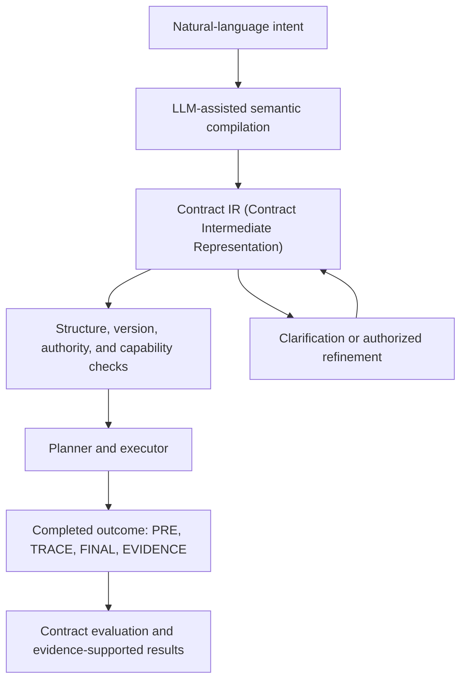

Natural-language agents are powerful, but instructions are not a stable interface: semantically equivalent requests can lead to different behavior, important constraints can remain implicit, and uncertain information can quietly be replaced with plausible guesses. This project investigates whether **Contract IR (Contract Intermediate Representation)** can form a semantic boundary between the intent people express and the actions agents actually carry out.

The long-term goal is to compile free-form intent into explicit, progressively refinable contracts before execution. A contract records requirements, permissions, pending choices, provenance, and evidence requirements so that deterministic components can validate and inspect them.

> Can a small, domain-independent constraint language, extended with versioned domain semantics, preserve human intent well enough to make AI execution more consistent, inspectable, and reliable?

The current kernel/plugin milestone addresses the underlying semantic questions. It has not validated a learned natural-language compiler, execution capabilities in real repositories, or planner performance, nor has it demonstrated improved reliability over agents that map language directly to actions.

Project repository: [SemanticCompiler](https://github.com/zjutoe/SemanticCompiler.git)

## The Long-Term System

The following diagram shows the long-term conceptual workflow. Integrating the compiler, planner, and executor remains future work.



In the future, an LLM could propose contracts, identify possible bindings, explain pending choices, and help plan implementations. It would not be authorized to redefine symbols, treat missing evidence as success, grant itself authority, or interpret checker failures as logical results. These meanings and failure boundaries are specified by the accepted kernel and exact plugin versions.

Further work could test whether this boundary improves semantic stability under paraphrasing, ambiguity detection, clarification decisions, the rate of silent deviations, and the performance of smaller or local models. Synthetic methods that generate language from IR, and semantic denoising, are historical research directions for learning a compiler; they are neither current research results nor an accepted implementation architecture.

## The Constraint Kernel and Versioned Plugins

Contract IR describes constraints on an abstract completed outcome:

```text
Outcome = (PRE, TRACE, FINAL, EVIDENCE)
```

These four components are semantic views of the pre-execution state, event trace, final state, and evidence store. They are not commands, mutable runtime storage, or step-by-step instructions for finding an implementation.

The **kernel** defines the meanings that all domains must share:

- The combination of hard requirements and permissions;
- Typed variables and pending choices assigned to designated controllers;
- Provenance, normative adoption of clauses by authorized actors, and authority;
- Exact identities for plugins and symbols, including versions;
- Structural well-formedness, closure (all required bindings are complete), and evaluability;
- Three-valued truth (`TRUE`, `FALSE`, `UNKNOWN`), with errors handled separately;
- Capability-relative consistency, entailment, and equivalence;
- Profile-relative completeness: determining whether coverage is complete according to a declared specification of semantic dimensions (a semantic profile).

Readable goals, preservation constraints, prohibitions, and permissions are derived from this smaller kernel wherever their meaning can be preserved. Permission for an event grants authority to perform it; it does not require the event to occur. A pending choice assigned to a designated controller is also distinct from a fact whose truth remains unknown while evidence is awaited.

**Plugins** supply domain meanings without changing the kernel's rules. They define precisely versioned types, values, functions, predicates, event meanings, evidence schemas, completeness profiles, evaluators, and optional symbolic reasoners. Machine-facing semantics and model-facing descriptions are bound to the same exact symbol and version. Plugins can add predicates for the coding domain, but cannot redefine truth, authority, provenance, bindings, or logical connectives.

## Satisfying Witnesses, Evidence, and the Limits of What Can Be Claimed

The design explicitly separates questions that agent systems often conflate:

- **Representability:** Can the stated intent be expressed by a contract?
- **Well-formedness and closure:** Is the record valid, and are all required choices, references, meanings, and exact versions bound?
- **Evaluability:** Are compatible, trusted services available for the requested judgment?
- **Consistency:** Is there an admitted satisfying witness, an admitted proof of contradiction, or neither?
- **Profile completeness:** Does the contract cover the semantic dimensions required by a declared profile?
- **Intent completeness:** Does the contract capture all of the intent expressed by the person?

Only the first five can be assessed relative to explicit semantics and capabilities. A contract cannot prove its own intent completeness.

A satisfying witness is an abstract completed outcome admitted under the bound semantics. It can establish that a set of constraints is jointly satisfiable without necessarily being a patch that can be built or an execution plan. When no witness is found, the conclusion is `UNKNOWN`, not a proven contradiction. Proofs, models, counterexamples, and witnesses can yield conclusions only after validation under their exact capability and trust contracts.

Evidence is attached to outcomes but cannot substitute for truth. Missing evidence may produce a logical `UNKNOWN`; malformed results, crashed evaluators, service-discovery failures, and reasoning failures remain separate error categories.

## Why Start with the Coding Domain?

Software work brings many difficult questions about agent semantics together in a concrete setting. A coding contract may relate a repository's pre-execution and final states, restrict paths that may be changed, prohibit or authorize trace events, require test evidence, preserve observable behavior, and retain a pending choice for the user to decide. Broad task-acceptance predicates are meaningful only when their inputs, observable scope, evidence access, and unknown/error behavior are explicit.

For example, consider this illustrative request: “Update the parser while preserving the public API. You may run only the parser test command. Ask me whether malformed input should return a null value or raise an error.” In plain language:

- Updating the parser is a requirement on the final state;
- Preserving the public API relates the pre-execution state to the final state;
- Permission to run the test command means only that the command is authorized, not that it must be run;
- The handling of malformed input remains a pending choice for the user;
- Whether the tests pass is a fact that remains unknown until evidence arrives, not a choice the user or executor can assign.

This only explains semantic distinctions; it is not executable Contract IR syntax.

The coding domain is a stress test of the extension boundary, not a privileged domain in the kernel. “Fix a bug,” “add a feature,” and “refactor” are not kernel primitives. A coding plugin must express these constraints without coding-specific kernel branches or access to hidden expected answers.

## Validation and Evidence

The design process is oriented toward falsification. A kernel construct is retained only when removing it would lose a demonstrated semantic distinction. The challenge set covers state relations, trace constraints, permissions, alternative outcomes, choices, unknown facts, provenance, exact versions, plugin-visible conflicts, and cases deliberately left undecidable. Held-out challenges are selected without knowledge of the final vocabulary; failures must remain visible as `UNREPRESENTABLE` or `UNKNOWN`, rather than being patched through special branches or hidden oracles (queries for expected answers).

Each phase is frozen against exact Git evidence and independently reviewed. K3-X subsequently tested an explicitly enumerated K2/K3-S slice. Under the bound runtime environment, all 13 checks passed, covering 102 fixture/assertion entries, 42 missing-data variants, and 3,740 reachable complete-value nodes.

This evidence establishes only that the selected finite semantic slice is executable and reproducible. It does not establish that K2 can be fully implemented, that the coding semantics are universal, that natural-language translation is correct, or that operations on real repositories are safe. Nor does it establish planner effectiveness or whether this representation is superior to other IRs.

## Current Status

| Phase | Purpose | Status |
|---|---|---|
| K0 | Freeze the scope, status vocabulary, challenge set, held-out procedure, and anti-oracle rules | Accepted and complete |
| K1 | Define the minimal kernel calculus and denotational semantics | Accepted and complete |
| K2 | Define the versioned plugin ABI, lifecycle, trust, evidence, and reasoning interfaces | Accepted and complete |
| K3-S | Define the minimal coding-plugin semantics and finite challenge package | Accepted and complete |
| K3-X | Implement a finite, in-memory executable K2/K3-S slice | Accepted and complete |
| K4 | Assess held-out semantic closure and manual language bindings | Roadmap only; no handoff or execution authorization |

Phase 0 is complete and serves only as historical engineering evidence for an earlier finite kernel. The controlled-coding Phase 1 milestone was paused after the accepted C0 commit `4e3135b` on branch `milestone/phase1-controlled-code-planning`; no C1 handoff was created, and the branch was not merged into `main`. Neither phase defines the current kernel.

## Documents and Sources

The current semantic basis consists of the following documents:

- [Contract IR Minimal Kernel and Coding Plugin Research Plan](https://github.com/zjutoe/SemanticCompiler/blob/main/docs/plans/Contract_IR_Kernel_and_Coding_Plugin_Research_Plan.md), accepted blob `01f959bc55f644a376f8ffa6059e9e77936be77c`, and its [independent review](https://github.com/zjutoe/SemanticCompiler/blob/main/docs/reviews/kernel_plugin/Contract_IR_Kernel_Plugin_Plan_3f7fc69_review.md);
- [K3-S/K3-X Plan Amendment](https://github.com/zjutoe/SemanticCompiler/blob/main/docs/plans/K3_Semantics_and_Executable_Spike_Amendment.md), accepted blob `7f1c3627245ec0c0fc86df64f77e374d104649a0`, and its [independent review](https://github.com/zjutoe/SemanticCompiler/blob/main/docs/reviews/kernel_plugin/K3_SX_Plan_19379b3_review.md).

Accepted results, in dependency order:

- [K0 Semantic Design Inputs](https://github.com/zjutoe/SemanticCompiler/blob/main/KernelPlugin/K0_Semantic_Design_Inputs_v0.md), blob `e86e184300a6620fb6fe25062635d9bc7cb410a1`, and its [review](https://github.com/zjutoe/SemanticCompiler/blob/main/docs/reviews/kernel_plugin/K0_Design_Inputs_6ad555e_review.md);
- [K1 Kernel Calculus](https://github.com/zjutoe/SemanticCompiler/blob/main/KernelPlugin/K1_Kernel_Calculus_and_Denotational_Semantics_v0.md), blob `d928010319c2c3bd08a94e1856cfca24dc2ae39e`, and its [review](https://github.com/zjutoe/SemanticCompiler/blob/main/docs/reviews/kernel_plugin/K1_Kernel_Calculus_f3418a6_review.md);
- [K2 Plugin ABI and Reasoning Interface](https://github.com/zjutoe/SemanticCompiler/blob/main/KernelPlugin/K2_Versioned_Plugin_ABI_and_Reasoning_Interface_v0.md), blob `1ea0d9fb014bf983c4c84f35e0c88590bd9e9ab4`, and its [review](https://github.com/zjutoe/SemanticCompiler/blob/main/docs/reviews/kernel_plugin/K2_Plugin_ABI_5b6f157_review.md);
- [K3-S Coding Plugin Semantics](https://github.com/zjutoe/SemanticCompiler/blob/main/KernelPlugin/K3_S_Minimal_Coding_Plugin_Semantics_v0.md), blob `31e9ffbaedcf7c1531a0a614078479f7cfefb1fe`, and its [review](https://github.com/zjutoe/SemanticCompiler/blob/main/docs/reviews/kernel_plugin/K3_S_Semantics_ced9082_review.md);
- [K3-X Executable Spike Report](https://github.com/zjutoe/SemanticCompiler/blob/main/docs/reports/kernel_plugin/K3_X_Executable_Spike_Report.md) and the [final independent acceptance review](https://github.com/zjutoe/SemanticCompiler/blob/main/docs/reviews/kernel_plugin/K3_X_Executable_Result_68927ab_review.md).

The [kernel/plugin workflow index](https://github.com/zjutoe/SemanticCompiler/blob/main/KernelPlugin/README.md) provides guidance by phase, and the [review index](https://github.com/zjutoe/SemanticCompiler/blob/main/docs/reviews/README.md) records exact review bindings.

The original [IR Design Memo v0](https://github.com/zjutoe/SemanticCompiler/blob/main/docs/plans/IR_Design_Memo_v0.md) and [Semantic Compiler Contract IR Research Plan](https://github.com/zjutoe/SemanticCompiler/blob/main/docs/plans/Semantic_Compiler_Contract_IR_Research_Plan.md) retain the broader research motivation and early hypotheses. They are historical background, not the current basis for semantics or execution.
