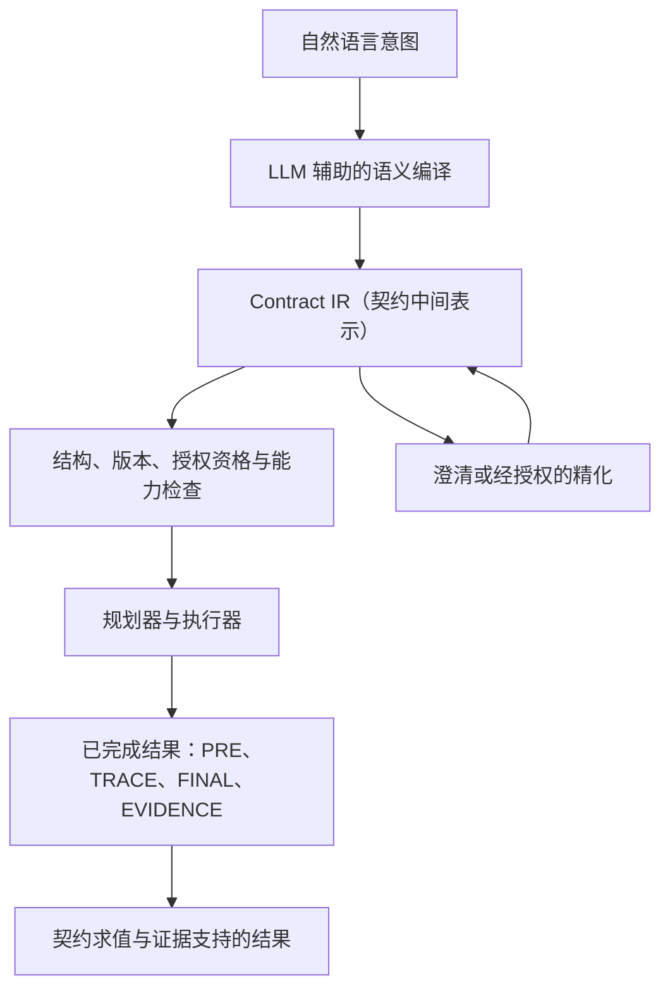

自然语言智能体能力强大，但指令并不是稳定的接口：语义等价的请求可能产生
不同的行为，重要约束可能处于隐含状态，而不确定信息可能被悄然替换为看似
合理的猜测。本项目研究 **Contract IR（契约中间表示）** 能否在人所表达的
意图与智能体实际执行的行为之间形成一道语义边界。

长期目标是在执行之前，把自由形式的意图编译成显式且可逐步精化的契约。
契约记录要求、权限、待决选择、来源（provenance）和证据要求，使
确定性组件能够对它们进行验证和检查。

> 一种小型、与领域无关的约束语言，在版本化领域语义的扩展下，能否充分
> 保留人的意图，从而让 AI 的执行更加一致、可检查且可靠？

当前的内核/插件里程碑正在回答其中的语义基础问题。它尚未验证学习型自然
语言编译器、真实代码仓库执行能力或规划器性能，也未证明相较于直接从
语言到动作的智能体能获得可靠性提升。

项目代码：[SemanticCompiler](https://github.com/zjutoe/SemanticCompiler.git)

## 长期系统

下图展示长期概念流程。编译器、规划器和执行器的集成仍属于未来工作。



未来，LLM 可以提出 Contract（契约）、识别可能的绑定、解释待决
选择，并协助规划实现方案。但它无权重定义符号、把缺失的证据当作成功、
自行赋予自己授权资格（authority），也不能把检查器故障当成逻辑结果。
这些含义和故障边界由已接受的内核与精确的插件版本规定。

后续工作可以检验这道边界能否改善同义改写下的语义稳定性、歧义检测、
澄清决策、静默偏离率，以及较小模型或本地模型的表现。通过 IR 生成语言
的合成方法和语义去噪，是用于学习编译器的历史研究方向；它们不是当前
研究结果，也不是已经接受的实现架构。

## 约束内核与版本化插件

Contract IR 描述针对一个抽象的已完成结果所施加的约束：

```text
Outcome = (PRE, TRACE, FINAL, EVIDENCE)
```

这四项分别是执行前状态、事件轨迹、最终状态和证据存储的语义视图。它们
不是命令、可变的运行时存储，也不是寻找实现方案的步骤说明。

**内核（kernel）** 负责所有领域必须共享的含义：

- 硬性要求与授权许可的组合；
- 类型化变量，以及由指定控制者负责的待决选择；
- 来源、有权主体对条款的采纳（normative adoption）和授权资格
  （authority）；
- 插件和符号的精确标识，包括版本；
- 结构良构性、闭合性（即所需绑定均已完备）和可求值性；
- 三值真值（`TRUE`、`FALSE`、`UNKNOWN`），并将错误单独处理；
- 相对于能力（capability）的一致性（consistency）、蕴涵（entailment）和
  等价性；
- 相对于 profile 的完备性，即依据声明的语义维度规范（语义配置）判断
  覆盖是否完整。

只要能够保持含义，可读的目标、保持约束、禁止事项和允许事项都由这个
更小的内核派生。对某个事件的 permission（许可）只授予执行权限，并不
要求该事件一定发生。由指定控制者负责的待决选择，也不同于一个在等待
证据时真值未知的事实。

**插件（plugin）** 在不改变内核规则的前提下提供领域含义。它们定义精确
版本的类型、值、函数、谓词、事件含义、证据 schema、完备性 profile、
求值器，以及可选的符号推理器。面向机器的语义和面向模型的描述绑定到
同一个精确符号与版本。插件可以加入编程领域的谓词，但不能重定义真值、
授权资格、来源、绑定或逻辑联结词。

## 满足性见证、证据与如实陈述的边界

本设计把智能体系统经常混为一谈的问题明确分开：

- **可表示性（Representability）：** 所陈述的意图能否由一个 Contract
  表达？
- **良构性与闭合性（Well-formedness and closure）：** 记录是否合法，
  所有必需的选择、引用、含义和精确版本是否均已绑定？
- **可求值性（Evaluability）：** 针对所请求的判断，是否有兼容且受信任
  的服务可用？
- **一致性（Consistency）：** 是否存在一个已准入的满足性见证
  （satisfying witness）、一个已准入的矛盾证明，或二者皆无？
- **Profile 完备性（Profile completeness）：** Contract 是否覆盖某个
  已声明 profile 所要求的语义维度？
- **意图完备性（Intent completeness）：** Contract 是否捕获了人所表达
  的全部意图？

只有前五项能够相对于显式语义和能力进行评估。Contract 无法自行证明其
意图完备性。

满足性见证（satisfying witness）是在绑定语义下获准采用的抽象已完成
结果。它可以证明一组约束共同可满足，却不必是一个能够构建的补丁或执行
计划。找不到见证时，结论是 `UNKNOWN`，而不是已经证明存在矛盾。证明、
模型、反例和见证，只有在其精确的能力与信任契约下通过验证后，才能产生
结论。

证据会附在结果上，但不能代替真值。缺失证据可能产生逻辑上的
`UNKNOWN`；格式错误的结果、崩溃的求值器、服务发现失败或推理失败，仍然
属于各自独立的错误类别。

## 为什么先从编程领域开始

软件工作把许多棘手的智能体语义集中在一个具体场景中。编程契约可能关联
代码仓库的执行前状态与最终状态、限制变更路径、禁止或授权轨迹事件、
要求测试证据、保持可观察行为，并保留一个需要由用户决定的待决选择。宽泛
的任务验收谓词，只有在其输入、可观察范围、证据访问方式以及未知/错误
行为都已明确时，才具有意义。

例如，考虑下面这个仅用于说明的请求：“在保持公共 API 不变的前提下更新
解析器。你只能运行解析器测试命令。请询问我：遇到格式错误的输入时，应
返回空值还是抛出错误。”用直白的话拆解：

- 更新解析器是对最终状态的要求；
- 保持公共 API 不变，把执行前状态与最终状态联系起来；
- 获准运行测试命令只表示该命令被授权，并不要求一定运行；
- 对格式错误输入的处理方式仍是需要由用户决定的待决选择；
- 测试是否通过，是证据到达前尚未知晓的事实，不是用户或执行器可以指定
  的选择。

这只是对语义区别的解释，并不是可执行的 Contract IR 语法。

编程领域是对扩展边界的压力测试，并不是内核中的特权领域。“修复缺陷”、
“增加功能”和“重构”都不是内核原语。编程插件必须在没有编程专用内核
分支、也不读取隐藏预期答案的情况下表达这些约束。

## 验证与证据

设计过程以证伪为导向。只有当删除某个内核构造会丢失已经证明存在的语义
区别时，才会保留该构造。挑战集覆盖状态关系、轨迹约束、许可、备选结果、
选择、事实未知、来源、精确版本、插件可见的冲突，以及刻意保留为不可判定
的案例。留出挑战（held-out challenges）在不知道最终词汇表的情况下选取；
失败必须以 `UNREPRESENTABLE` 或 `UNKNOWN` 的形式保留下来，不能通过
特殊分支或隐藏 oracle（预期答案查询）进行修补。

每个阶段都冻结到精确的 Git 证据，并接受独立审查。随后，K3-X 测试了
一个显式枚举的 K2/K3-S 切片。在绑定的运行时环境下，它的 13 项检查全部
通过，覆盖 102 个 fixture/assertion 条目、42 个缺失数据变体和 3,740 个
可达的完整值节点。

这些证据只表明所选的有限语义切片可执行且可复现。它没有证明 K2 可以被
完整实现、编程语义具有普适性、自然语言翻译正确或真实代码仓库操作安全，
也没有说明规划器效果如何，或本表示是否优于其他 IR。

## 当前状态

| 阶段 | 目的 | 状态 |
|---|---|---|
| K0 | 冻结范围、状态词汇、挑战集、留出流程和反 oracle 规则 | 已接受并完成 |
| K1 | 定义最小内核演算与指称语义 | 已接受并完成 |
| K2 | 定义版本化插件 ABI、生命周期、信任、证据与推理接口 | 已接受并完成 |
| K3-S | 定义最小编程插件语义与有限挑战包 | 已接受并完成 |
| K3-X | 实现有限的内存内 K2/K3-S 可执行切片 | 已接受并完成 |
| K4 | 评估留出语义闭合性与人工语言绑定 | 仅列入路线图；没有 handoff 或执行授权 |

Phase 0 已经完成，它只是早期有限内核的历史工程证据。受控编程 Phase 1
里程碑在已接受的 C0 commit `4e3135b` 后暂停，所在分支为
`milestone/phase1-controlled-code-planning`；没有创建 C1 handoff，
该分支也没有合并到 `main`。这两个阶段都不定义当前内核。

## 文档与来源

当前语义依据由以下文档构成：

- [Contract IR 最小内核与编程插件研究计划](https://github.com/zjutoe/SemanticCompiler/blob/main/docs/plans/Contract_IR_Kernel_and_Coding_Plugin_Research_Plan.md)，已接受 blob `01f959bc55f644a376f8ffa6059e9e77936be77c`，以及它的[独立审查](https://github.com/zjutoe/SemanticCompiler/blob/main/docs/reviews/kernel_plugin/Contract_IR_Kernel_Plugin_Plan_3f7fc69_review.md)；
- [K3-S/K3-X 计划修正案](https://github.com/zjutoe/SemanticCompiler/blob/main/docs/plans/K3_Semantics_and_Executable_Spike_Amendment.md)，已接受 blob `7f1c3627245ec0c0fc86df64f77e374d104649a0`，以及它的[独立审查](https://github.com/zjutoe/SemanticCompiler/blob/main/docs/reviews/kernel_plugin/K3_SX_Plan_19379b3_review.md)。

按依赖顺序排列的已接受结果：

- [K0 语义设计输入](https://github.com/zjutoe/SemanticCompiler/blob/main/KernelPlugin/K0_Semantic_Design_Inputs_v0.md)，blob `e86e184300a6620fb6fe25062635d9bc7cb410a1`，及其[审查](https://github.com/zjutoe/SemanticCompiler/blob/main/docs/reviews/kernel_plugin/K0_Design_Inputs_6ad555e_review.md)；
- [K1 内核演算](https://github.com/zjutoe/SemanticCompiler/blob/main/KernelPlugin/K1_Kernel_Calculus_and_Denotational_Semantics_v0.md)，blob `d928010319c2c3bd08a94e1856cfca24dc2ae39e`，及其[审查](https://github.com/zjutoe/SemanticCompiler/blob/main/docs/reviews/kernel_plugin/K1_Kernel_Calculus_f3418a6_review.md)；
- [K2 插件 ABI 与推理接口](https://github.com/zjutoe/SemanticCompiler/blob/main/KernelPlugin/K2_Versioned_Plugin_ABI_and_Reasoning_Interface_v0.md)，blob `1ea0d9fb014bf983c4c84f35e0c88590bd9e9ab4`，及其[审查](https://github.com/zjutoe/SemanticCompiler/blob/main/docs/reviews/kernel_plugin/K2_Plugin_ABI_5b6f157_review.md)；
- [K3-S 编程插件语义](https://github.com/zjutoe/SemanticCompiler/blob/main/KernelPlugin/K3_S_Minimal_Coding_Plugin_Semantics_v0.md)，blob `31e9ffbaedcf7c1531a0a614078479f7cfefb1fe`，及其[审查](https://github.com/zjutoe/SemanticCompiler/blob/main/docs/reviews/kernel_plugin/K3_S_Semantics_ced9082_review.md)；
- [K3-X 可执行原型报告](https://github.com/zjutoe/SemanticCompiler/blob/main/docs/reports/kernel_plugin/K3_X_Executable_Spike_Report.md)，以及[最终独立验收](https://github.com/zjutoe/SemanticCompiler/blob/main/docs/reviews/kernel_plugin/K3_X_Executable_Result_68927ab_review.md)。

[内核/插件流程索引](https://github.com/zjutoe/SemanticCompiler/blob/main/KernelPlugin/README.md)按阶段提供指引，
[审查索引](https://github.com/zjutoe/SemanticCompiler/blob/main/docs/reviews/README.md)记录精确的审查绑定。

原 [IR Design Memo v0](https://github.com/zjutoe/SemanticCompiler/blob/main/docs/plans/IR_Design_Memo_v0.md) 和
[Semantic Compiler Contract IR Research Plan](https://github.com/zjutoe/SemanticCompiler/blob/main/docs/plans/Semantic_Compiler_Contract_IR_Research_Plan.md)
保留更广泛的研究动机和早期假设。它们属于历史背景，不是当前语义或执行
依据。
